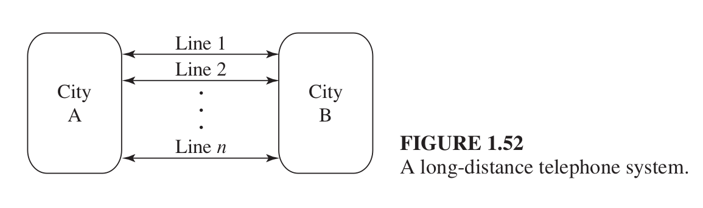

### A long-distance telephone system
Reference: A. M. Law, Simulation Modelling & Analysis 5th edition,
Problem number 1.29, page 83

Of interest in telephony are models of the following type. Between two large cities, A
and B, are a fixed number, n, of long-distance lines or circuits.

Each line can operate
in either direction (i.e., can carry calls originating in A or B) but can carry only one call at a time; see Fig. 1.52. If a person in A or B wants to place a call to the other city nd a line is open (i.e., idle), the call goes through immediately on one of the open lines. If all n lines are busy, the person gets a recording saying that she must hang up and try later; there are no facilities for queueing for the next open line, so these blocked callers just go away. The times between attempted calls from A to B are exponential with mean 10 seconds, and the times between attempted calls from B to A are exponential with mean 12 seconds. The length of a conversation is exponential with mean 4 minutes, regardless of the city of origin. Initially all lines are open, and the simulation is to run for 12 hours; compute the time-average number of lines that are busy, the time-average proportion of lines that are busy, the total number of attempted calls (from either city), the number of calls that are blocked, and the proportion of calls that are blocked. Determine approximately how many lines would be needed so that no more than 5 percent of the attempted calls will be blocked.

