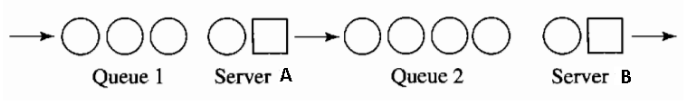

## Simulation of Two Servers in Sequence

**Reference:** Reference: A. M. Law, Simulation Modeling & Analysis 3rd edition, Problem 2.27, page 191

### Problem Description

A queueing system has two servers (A and B) in series, and two types of customers (1 and 2). Customers arriving to the system have their types determined immediately upon their arrival. 

An arriving customer is classified as type 1 with probability 0.6. However, an arriving customer may balk, i.e., may not actually join the system, if the queue for server A is too long. Specifically, assume that if an arriving customer finds <i>m</i> (<i>m</i>≥ 0) other customers already in the queue for A, he will join the system with probability 1/(<i>m</i> + 1), regardless of the type (1 or 2) of customer he may be. Thus, for example, an arrival finding nobody else in the queue for A (i.e., <i>m</i> = 0) will join the system for sure [probability = 1/(0 + 1) = 1], whereas an arrival finding 5 others in the queue for A will join the system with probability = 1/6.

All customers are served by A. (If A is busy when a customer arrives, the customer joins a FIFO queue.) Upon completing service at A, type 1 customers leave the system, while type 2 customers are served by B. (If B is busy, type 2 customers wait in a FIFO queue.) Compute the average <i>total</i> time each type of customer spends in the <i>system</i>, as well as the number of balks. Also compute the time-average and maximum length of each queue, and both server utilizations. Assume that all interarrival and service times are exponentially distributed, with the following parameters:
* Mean interarrival time (for any customer type) = 1 minute
* Mean service time at server A (regardless of customer type) = 0.8 minute
* Mean service time at server B = 1.2 minutes

Initially the system is empty and idle, and is to run until 1000 customers (of either type) have left the system. Use stream 1 for determining the customer type, stream 2 for deciding whether a customer balks, stream 3 for interarrivals, stream 4 for service times at A (of both customer types), and stream 5 for service times at B.

 
